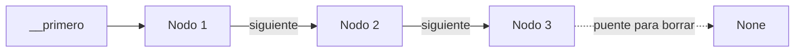
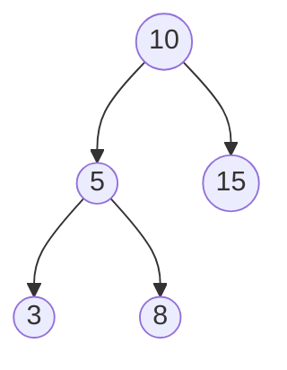

# 🚀 Machete Definitivo - Estructura de Datos (Parcial 2)

> **Nota de Oro:** Como el parcial es en papel, podés y debés usar los nombres privados directos: `self.__primero`, `self.__raiz`, etc. Olvidate de los guiones bajos raros del simulador.

---

## 1. DICCIONARIOS
**Estrategia General:** Usar los métodos del propio TDA cuando sea posible (`keys()`, `hasKey()`, `insert()`, `remove()`). Si necesitás recorrerlo por dentro, acordate que es una lista de tuplas: `for k, v in self.__datos:`.

### 🔹 Intersección (Los que están en ambos)
```python
def interseccion(self, otro_dicc):
    nuevo = Diccionario()
    for k in self.keys():
        if otro_dicc.hasKey(k):
            # Lógica (ej: sumar valores de ambos)
            nuevo.insert(k, self[k] + otro_dicc[k])
    return nuevo
```

### 🔹 Diferencia (Están en A pero no en B)
```python
def diferencia(self, otro_dicc):
    for k in otro_dicc.keys():
        if self.hasKey(k):
            self.remove(k) # Borrar del actual si el otro lo tiene
```

### 🔹 Contar Frecuencias de una Lista (Típico)
```python
def contar_frecuencias(lista_palabras):
    d = Diccionario()
    for p in lista_palabras:
        if d.hasKey(p):
            d.insert(p, d[p] + 1) # Ya existe, le sumo 1
        else:
            d.insert(p, 1) # Primera aparición
    return d
```

---

## 2. LISTAS ENLAZADAS
**Estrategia General:** ¡DIBUJAR! Siempre verificá: 
1) ¿Avanzó el puntero al final del `while`?
2) ¿Evaluás el valor de `nodo.siguiente` en vez del actual para poder hacer el puente?
3) Para manejar posiciones numéricas, usá siempre un `contador = 1`.



### 🔹 Borrar Nodos según una Condición
Se evalúa el `.siguiente` para pararse un vagón antes y puentearlo.
```python
def borrarPares(self):
    nodo = self.__primero
    while nodo.tiene_siguiente():
        if nodo.siguiente.dato % 2 == 0:
            # PUENTE (Borro el siguiente)
            nodo.siguiente = nodo.siguiente.siguiente 
        else:
            # SOLO AVANZO si no borré nada (evita saltarse nodos consecutivos infinitos)
            nodo = nodo.siguiente
```

### 🔹 Insertar o Borrar en una Posición N (El "Off-By-One")
Evitá los errores matemáticos de índices: Arrancá a contar en 1 y frená tu `while` en `N - 1`.
```python
def eliminarEnPosicion(self, N):
    nodo = self.__primero
    pos = 1
    # Freno EXACTAMENTE un nodo antes (N - 1)
    while pos < (N - 1) and nodo.tiene_siguiente():
        nodo = nodo.siguiente
        pos += 1
    
    # Hago el puente
    if nodo.tiene_siguiente():
        nodo.siguiente = nodo.siguiente.siguiente
```

### 🔹 ALGORITMO CLÁSICO: Invertir una Lista (Reverse)
Un favorito de los finales y parciales. Te piden dar vuelta toda la lista cambiando solo punteros.
```python
def invertir(self):
    previo = None
    actual = self.__primero
    while actual is not None:
        siguiente_temp = actual.siguiente # 1. Guardo el de la derecha
        actual.siguiente = previo         # 2. Apunto a la izquierda (invierto flecha)
        previo = actual                   # 3. Avanzo el ancla 'previo'
        actual = siguiente_temp           # 4. Avanzo 'actual'
    self.__primero = previo # El último nodo ahora pasa a ser el primero
```

---

## 3. ÁRBOLES BINARIOS (ABB)
**Estrategia General:** Recursividad. El Árbol llama a la Raíz. El Nodo hace la magia (siempre fijándose `tieneIzquierdo()` y `tieneDerecho()`).



### 🔹 Estructura Base Universal (El Árbol delegando al Nodo)
```python
# En el ÁRBOL:
def operacion(self):
    if self.__raiz is None: return 0
    return self.__raiz.operacion()

# En el NODO:
def operacion(self):
    res = 0 # O lógica del nodo actual
    if self.tieneIzquierdo():
        res += self.izquierdo.operacion()
    if self.tieneDerecho():
        res += self.derecho.operacion()
    return res
```

### 🔹 ALGORITMO CLÁSICO: Invertir / Árbol Espejo
Cambia la rama izquierda por la derecha en todos los nodos.
```python
# En el NODO:
def espejo(self):
    # Intercambio punteros directamente
    temp = self.izquierdo
    self.izquierdo = self.derecho
    self.derecho = temp
    
    # Sigo bajando por las ramas para que todos giren
    if self.tieneIzquierdo():
        self.izquierdo.espejo()
    if self.tieneDerecho():
        self.derecho.espejo()
```

### 🔹 ALGORITMO CLÁSICO: Buscar si existe un valor
Aprovechando que es un Árbol Binario de BÚSQUEDA (menores a la izq, mayores a la der).
```python
# En el NODO:
def existe(self, buscado):
    if self.dato == buscado:
        return True # ¡Lo encontré!
    
    # Si es menor, me tiro por el tobogán izquierdo
    if buscado < self.dato and self.tieneIzquierdo():
        return self.izquierdo.existe(buscado)
        
    # Si es mayor, me tiro por el tobogán derecho
    elif buscado > self.dato and self.tieneDerecho():
        return self.derecho.existe(buscado)
        
    return False # Llegué al fondo y no estaba
```

### 🔹 Sumar/Contar hasta el Nivel 'N' (El truco del parámetro extra)
Se pasa un parámetro `nivel_actual` por recursión (arranca en 0 en la clase Árbol).
```python
# En el NODO (recibe N y nivel_actual)
def sumarHastaNivel(self, N, nivel_actual):
    if nivel_actual > N: 
        return 0 # Si ya me hundí más allá del nivel N, corto el mambo
        
    suma = self.dato
    if self.tieneIzquierdo():
        suma += self.izquierdo.sumarHastaNivel(N, nivel_actual + 1) # Le sumo 1 al nivel
    if self.tieneDerecho():
        suma += self.derecho.sumarHastaNivel(N, nivel_actual + 1)
    return suma
```

---

### ⚠️ TATUAJES MENTALES PARA EL PARCIAL ⚠️
1. **Bucle Infinito Mortal:** Si usaste un `while` en una lista, ¡chequeá que adentro exista `nodo = nodo.siguiente`! (Excepto cuando borrás y hacés un puente).
2. **El Puente:** Nunca elimines pisando el nodo (`nodo = nodo.siguiente.siguiente` está MAL). Si querés volar a `B` (A->B->C), parate en `A` y hacé `A.siguiente = A.siguiente.siguiente`.
3. **Miedo al vacío:** En Árboles, NO llames a `self.izquierdo.operacion()` sin antes preguntar `if self.tieneIzquierdo():`. Si llamás a la nada, tira excepción y te restan puntos.
4. **Lapicera en mano:** Si el de Listas Enlazadas te empieza a marear, agarrá los márgenes de la hoja y **dibujá los cuadraditos con las flechas**. Es la única forma de no perderse.
